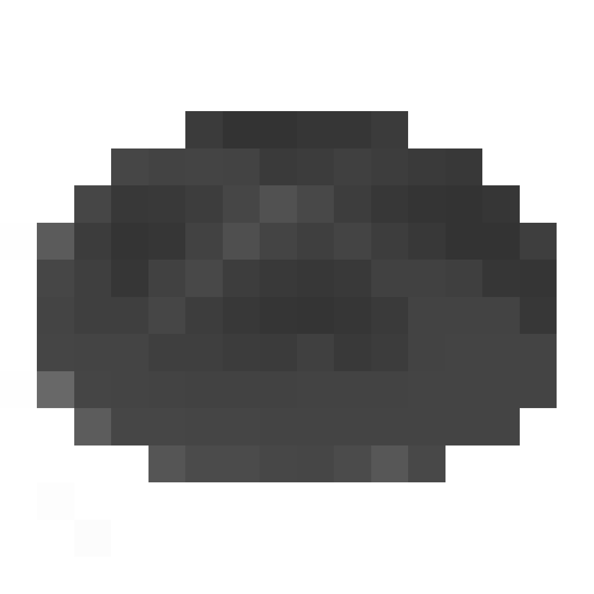

This is a script written by me that does will take any image (preferably with alpha)
and turns it into a custom wielditem-like-model with correct uvs without clipping.
The usage is thus:

`python3 convert_itemtexture_to_obj.py <image_path> <output_path> <lowest_alpha (optional)>`

lowest_alpha being the lowest alpha a pixel will be before becoming nonexistent in the model. (default is 100 of 255)

## example:

`python3 convert_itemtexture_to_obj.py bread.png bread.obj 200`

image-rendering: pixelated;

#### imput image (scaled for easier viewing):

#### output model:

